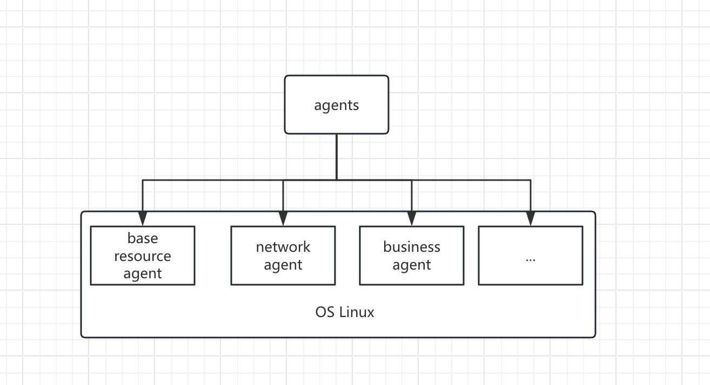

# AI运维助手
* 自动巡检并处理异常问题
* 最小可行验证方式，仅提供思路，代码部份边界约束条件较不完善，可尝试玩一玩
# 使用方式
```shell
# 注意区分架构版本
$ curl -o ./ai-ops-agent https://github.com/huangjc7/ai-ops-agent/releases/download/v1.0.1/ai-ops-agent-arm64
$ chmod +x ./ai-ops-agent
$ ./ai-ops-agent --url="https://dashscope.aliyuncs.com/compatible-mode/v1/" \
  --model="qwen-plus" \
  --apikey="sk-8f058cb17awqdkadsd0ada4233be"
```
# 使用效果
[](https://asciinema.org/a/Ht6kxUK5r8WeeHWNYRmsEezrr)
# 实现方式
* prompt + function calling
* 后续可通过RAG增强巡检部份功能，支持特定业务巡检
# 编译方式
```shell
make build-arm64 # 编译Linux系统arm64架构
make build-amd64 # 编译Linux系统amd64架构
```
# 目前适配模型
| 模型        | 是否支持 |
|-----------|------|
| 阿里千问plus  | ✅    |
| 阿里千问max    | ✅    |
| 阿里千问turbo  | ✅    |
| 腾讯混元      | ✅    |
| ChatGPT-4o | ✅    |
| ChatGPT-4.5 | ✅    |
# 目前支持巡检项目
```text
    - CPU负载
    - 网络联通性
    - 磁盘空间
    - 内存使用
    - SSH服务状态
    - 网络监听端口
    - Docker进程
    - Docker服务运行状态
```
# 后续代办
- 解决上下文长度问题
- 解决全局共享单个会话历史，采用多上下文进行异步协同处理
- 后续演进方向
- 在线更新agent能力
- 完善function calling处理函数，包括参数支持，执行错误持续反馈ai&返回控制台
Multi-agent，多智能体协作
